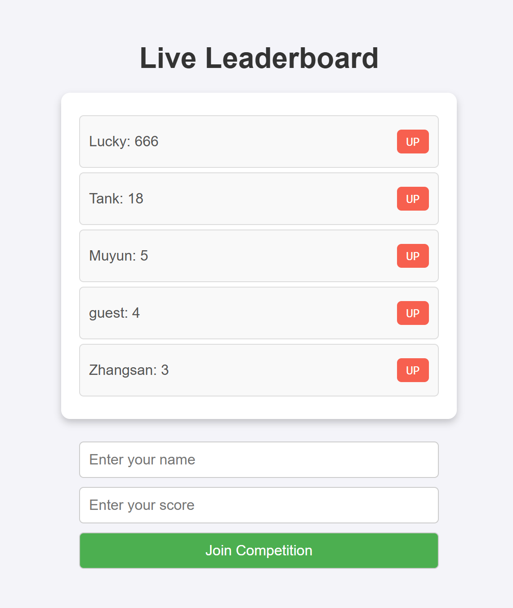

# Live Leaderboard

Live Leaderboard is a real-time web application that allows users to join a competition, view the leaderboard, and update scores dynamically. This project is hosted on [Firebase Hosting](https://firebase.google.com/) and uses Firebase Realtime Database for real-time updates.

---

## Features

- Users can:
  - Join the competition by entering their name and initial score.
  - View a dynamically updating leaderboard sorted by scores.
  - Increment their score using the `+1` button.

- Fully responsive design, optimized for desktop and mobile devices.

---

## Live Demo

Access the live project here: **[Live Leaderboard](https://liveleaderboard-235f3.web.app)**

---

## Demo Screenshot

Here is a screenshot of the Live Leaderboard in action:

---

## Technologies Used

- **Frontend**: HTML, CSS, JavaScript
- **Backend**: Firebase Realtime Database
- **Hosting**: Firebase Hosting

---
